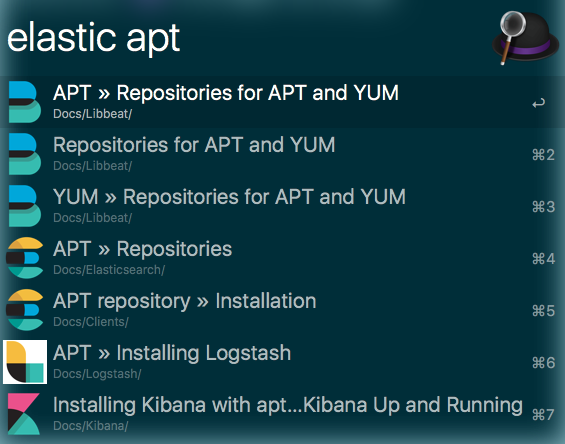

# Elasticsearch documentation alfred workflow

An alfred workflow, that queries the Elastic documentation and allows you to open the documentation in a browser directly from Alfred.

**Note**: You will need the Alfred [Powerpack](https://www.alfredapp.com/powerpack/) to use this workflow - which is commercial software. Check out the [Alfred app](https://www.alfredapp.com/) website.

## Download

You can download the workflow from [the packal alfred workflow repository](http://www.packal.org/), if you don't want to build it yourself.

**Note**: You need to have node.js installed to get up and running. You can check by executing `node --version`, as you need a node version >= 4.0 (which, frankly, should be pretty standard nowadays).

## Usage

The keyword to trigger the search in Alfred is `elastic` by default.

You can search across the whole documentation, or you can limit by a product by using something like `elastic b beat`. These are the available product abbreviations:

| Letter | Product                              |
| ------ | ------------------------------------ |
| `b`    | libbeat                              |
| `mb`   | Metricbeat                           |
| `pb`   | Packetbeat                           |
| `tb`   | Topbeat                              |
| `wb`   | Winlogbeat                           |
| `fb`   | Filebeat                             |
| `e`    | Elasticsearch                        |
| `es`   | Elasticsearch                        |
| `esg`  | Elasticsearch - The definitive guide |
| `esr`  | Elasticsearch - Reference            |
| `x`    | Xpack                                |
| `m`    | Marvel                               |
| `w`    | Watcher                              |
| `s`    | Shield                               |
| `g`    | Graph                                |
| `l`    | Logstash                             |
| `ls`   | Logstash                             |
| `k`    | Kibana                               |
| `h`    | Apache Hadoop                        |
| `c`    | Cloud                                |

In addition when specifying a product, you can also specify a version like `elastic w 2.3 execute watch`

## Packaging

You need the `zip` binary installed. Run `npm install` and then just run `npm run package` and you will end up with a `elastic.alfredworkflow` that you can open (doubleclick or call `open` on the command line) and import. Again, if you just want to use this workflow, download it from the packal repository linked above.

## Development

In order to test your workflow it is easier to create a new workflow in Alfred, that points to your development repository with an absolute path pointing to the `index.js` file.
Alternatively you can run the tests to ensure everything works and use the `index-cli.js` tool to check the output against the suggest endpoint, which does not require you to import any workflow in Alfred at all.

In order to run your tests, just execute `npm run test` - which will use babel to convert the code to node4 compatible javascript, before running the tests against the created code. As the tests use later node.js features, you need a recent node.js version to actually run the tests (I used 6.3.0 for development).

## License

This is licensed under Apache2 license, because [open source...](https://www.flickr.com/photos/nez/8725092093)!

## Thanks

* [Colin](https://github.com/colings86) for testing, feedback, fixes and documentation improvements.
* [Sindre Sorhus](https://github.com/sindresorhus) for code improvements

